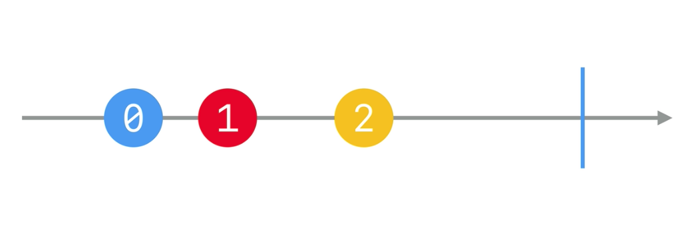

# 🔭
# 01. Observables and Observers

모두 같은 말인데 `Observable`이라는 용어를 사용할 예정

- Observable
- Observable Sequence
- Sequence

Observable은 `이벤트를 전달`  
Observer가 Observable을 감시하는 것을 `구독`한다고 표현  
그래서 Observer는 `Subscriber(구독자)`로 부르기도 함

Observable은 3가지 이벤트를 전달  
- Observable에서 발생한 새로운 이벤트는 `Next 이벤트`를 통해서 구독자에게 전달  
이벤트에 값이 포함되어 있다면 Next 이벤트와 함께 전달
- Observable에서 에러가 발생하면 `Error 이벤트`가 전달
- Observable이 정상적으로 종료되면 `Completed 이벤트`가 전달

<br/>

- Next 이벤트를 전달하는 것을 `Emission(방출, 배출)`이라고 표현함
- Observable의 Life Cycle 동안 Next 이벤트가 하나도 전달되지 않는 경우가 있고 하나 이상 전달되는 경우도 있음
- Error, Completed 이벤트는 Observable의 Life Cycle에서 가장 마지막에 전달되고 `Notification`이라고 부름
- 이후 Observable이 종료되고 모든 리소스가 정리되기 때문에 다른 이벤트는 전달되지 않음

<br/>

Observable의 동작을 `그림`으로 표현



- 화살표는 `상대적인 시간의 흐름`을 나타냄
- 화살표 위에 표시한 개별 원은 `next 이벤트`
- next 이벤트는 `값을 포함할 수 있고` 위 이미지처럼 원 내부에 저장된 값을 표현함
- 화살표 오른쪽에 표시한 버티컬 바는 `완료`를 나타냄  
→ `completed 이벤트`이고 Observable의 Life Cycle은 여기에서 종료됨


- Observable에서 error가 발생한 경우에는 X로 표현함
- `error 이벤트`이고 completed 이벤트와 마찬가지로 Life Cycle이 종료됨
- RxSwift에서는 위 이미지들을 `Marble Diagram`이라고 부름

<br/>

`Marble Diagram` - Observable과 연산자의 동작을 시각적으로 보여줌  
[RxMarbles: Interactive diagrams of Rx Observables](https://rxmarbles.com/)  
[RxSwiftCommunity/RxMarbles](https://github.com/RxSwiftCommunity/RxMarbles)

# Observable 생성

## 1. 이벤트 전달 코드를 직접 구현

```swift
Observable<Int>.create { (observer) -> Disposable in
    // observer에서 on 메소드를 호출하고 next 이벤트에 숫자 0을 담아서 전달
    // 이렇게 하면 구독자로 0이 저장되어 있는 next 이벤트가 전달
    observer.on(.next(0))
    
    // 1이 저장되어 있는 next 이벤트가 전달
    observer.onNext(1)
    
    // completed 이벤트가 전달되고 Observable이 종료
    // 이후에 다른 이벤트는 전달 못 함
    observer.onCompleted()
    
    // 메모리 정리에 필요한 객체
    return Disposables.create()
}
```
- `create 연산자`는 Observable 타입 프로토콜에 선언되어 있는 타입 메소드
- RxSwift에서는 이런 메소드를 `연산자`라고 부름
- `.on(.next(:))`와 `.onNext(:)`는 똑같음

## 2. 미리 정의된 규칙에 따라서 이벤트를 전달

```swift
Observable.from([0, 1])
```
- `from 연산자`는 파라미터로 전달된 배열의 요소를 순서대로 방출하고 completed 이벤트를 전달하는 Observable을 생성  
- 단순히 순서대로 방출하는 Observable을 생성할 때는 create 연산자로 직접 구현하는 것보다 from과 같은 다른 연산자들을 활용하는 게 좋음

**Observable은 `이벤트가 어떤 순서로 전달되어야 하는지 정의`만 함**  
**Observer가 Observable을 `구독하는 시점`에 next 이벤트를 통해 데이터를 받고 completed 이벤트가 전달됨**

# Observable 구독

Observer가 구독을 하는 방법은 `Observable에서 subscribe 메소드를 호출`하는 것  
subscribe 메소드는 `subscribe 연산자`라고 부르기도 함

Observable은 `이벤트가 전달되는 순서`를 정의  
실제 이벤트가 전달되는 시점은 Observer가 `구독을 하는 시점`

subscribe 메소드를 호출하고 클로저를 전달하면 `이벤트가 클로저로 전달`

<br/>

```swift
let o1 = Observable<Int>.create { (observer) -> Disposable in
   observer.on(.next(0))
   observer.onNext(1)
   
   observer.onCompleted()
   
   return Disposables.create()
}
```
- 가독성을 위해 Observable을 상수 o1에 저장

<br/>

```swift
// #1
o1.subscribe {
    print($0)
    
    if let elem = $0.element {
        print(elem)
    }
}
// 출력 결과
//next(0)
//0
//next(1)
//1
//completed
```
- subscribe 메소드는 `클로저를 파라미터로 받고 클로저로 이벤트가 전달됨`
- 이벤트에 저장된 값은 `element의 속성`을 통해 얻을 수 있고 형식이 옵셔널이기 때문에 옵셔널 바인딩이 필요함

<br/>

```swift
subscribe(onNext:onError:onCompleted:onDisposed:)
```
```swift
// #2
o1.subscribe(onNext: { elem in
    print(elem)
})
// 출력 결과
// 0
// 1
```
- 하나의 클로저로 모든 이벤트를 처리하는 방법
- `개별 이벤트를 별도의 클로저에서 처리하고 싶을 때 사용`
- 파라미터는 `기본값이 nil`로 선언되어 있어서 처리하지 않는 이벤트에 해당하는 파라미터는 생략 가능
- 위 방법에서는 클로저 파라미터로 next 이벤트에 저장된 요소가 바로 전달되고 element 요소에 접근할 필요가 없음

<br/>

```swift
o1.subscribe {
    print("== Start ==")
    print($0)
    
    if let elem = $0.element {
        print(elem)
    }
    print("== End ==")
}
// 출력 결과
//== Start ==
//next(0)
//0
//== End ==
//== Start ==
//next(1)
//1
//== End ==
//== Start ==
//completed
//== End ==
```
- Observer는 동시에 2개 이상의 이벤트를 처리하지 않음
- Observable은 Observer가 하나의 이벤트를 처리한 후에 이어지는 이벤트를 전달
(여러 이벤트를 동시에 전달하지 않음)
- 위 출력 결과를 보면 `항상 하나의 이벤트가 처리된 다음에 이어지는 이벤트가 전달됨`
