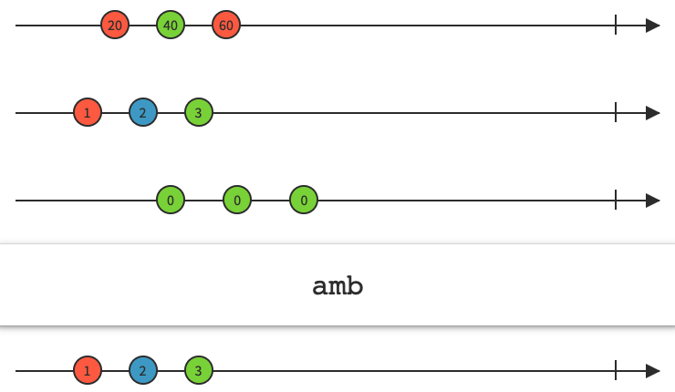

# ☑️
# 09. Conditional Operators

# amb



- 두 개 이상의 소스 Observable 중에서 `가장 먼저 next 이벤트를 전달한 Observable을 구독하고 나머지는 무시함`
- 위 이미지에서 가장 먼저 next 이벤트를 전달하는 것은 두 번째 Observable이고 이 Observable이 전달하는 이벤트가 구독자에게 전달되고 나머지는 무시됨
- amb 연산자를 사용하면 `여러 서버로 요청을 전달하고 가장 빠른 응답을 처리하는 패턴`을 구현할 수 있음

<br/>

```swift
func amb<O2: ObservableType>(_ right: O2) -> Observable<Element> where O2.Element == Element
```

- 하나의 Observable을 파라미터로 받음
- 두 Observable 중에서 먼저 이벤트를 전달하는 Observable을 구독하고 이 Observable의 이벤트를 구독자에게 전달하는 새로운 Observable을 리턴함

<br/>

```swift
func amb<Sequence: Swift.Sequence>(_ sequence: Sequence) -> Observable<Element> where Sequence.Element == Observable<Element>
```

- 만약 3개 이상의 Observable을 대상으로 연산자를 사용해야 한다면 타입 메소드로 구현되어 있는 연산자를 사용
- 이때는 모든 소스 Observable을 `배열 형태`로 전달함

<br/>

아래 코드에서 사용한 amb는 소스 Observable이 2개로 제한됨

```swift
let a = PublishSubject<String>()
let b = PublishSubject<String>()
let c = PublishSubject<String>()

a.amb(b)
    .subscribe { print($0) }
    .disposed(by: bag)

a.onNext("A")
b.onNext("B")
// 출력 결과
//next(A)
```

- a subject가 b subject 보다 먼저 이벤트를 방출함 → amb는 a subject를 구독하고 b는 무시함
- 결과를 보면 a subject로 전달한 next 이벤트만 구독자에게 전달되었음

<br/>

```swift
a.onNext("A")
b.onNext("B")

b.onCompleted()
// 출력 결과
//next(A)
```

- b subject가 전달하는 다른 이벤트도 무시됨
- completed 이벤트나 error 이벤트를 전달해도 구독자에게는 전달되지 않음

<br/>

```swift
a.onNext("A")
b.onNext("B")

b.onCompleted()

a.onCompleted()
// 출력 결과
//next(A)
//completed
```

- a subject가 전달하는 이벤트는 바로 구독자에게 전달됨
- amb 연산자는 두 개 이상의 소스 Observable 중에서 가장 먼저 이벤트를 전달하는 Observable을 구독하고 나머지는 무시함

<br/>

타입 메소드로 구현된 amb 연산자

```swift
let a = PublishSubject<String>()
let b = PublishSubject<String>()
let c = PublishSubject<String>()

Observable.amb([a, b, c])
    .subscribe { print($0) }
    .disposed(by: bag)

a.onNext("A")
b.onNext("B")

b.onCompleted()

a.onCompleted()
// 출력 결과
//next(A)
//completed
```

연산자를 호출하고 `모든 소스 Observable을 배열로 전달`하면 됨
